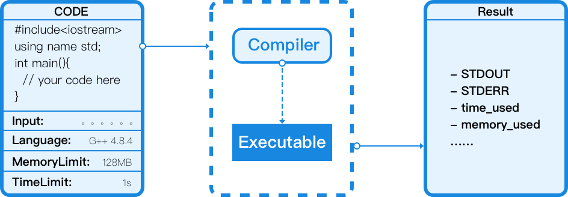
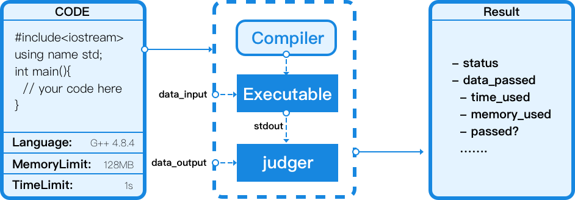

# CodeVS Engine 有什么?

codevs engine 是一个 SaaS 服务，支持多种语言的代码云端编译与运行。提供以下服务。

## 代码片段运行 [Snippet] 

可以将代码在云端进行编译和运行。您可以自定义程序的输入, 程序的最大运行时间和程序的最大可用内存。我们将运行后的结果反馈给您。

## 题目托管与评测 [Problem]

您可以将题目的相关数据存放在 codevs engine 中，并提交一份代码，engine 将在云端评测并运行该代码，将运行输出与标准数据比对，从而判断该代码的正确性并反馈。

## 语言支持

目前 codevs engine 支持

| 语言      | 编译器              | 版本    |
| ------- | ---------------- | ----- |
| c++     | g++ (with c++11) | 4.8.4 |
|         | g++ (with c++14) | 4.8.4 |
| c       | gcc              | 4.8.4 |
| pascall | fpc              | 2.6.2 |
| python  | pypy             | 2.7   |
|         |                  | 3.5   |
| python  | cpython          | 2.7   |
| Golang  | go               | 1.4   |
|         |                  | 1.7   |
| nodejs  | node             | 7.4   |
| java    | jdk              | 1.7   |
|         |                  | 1.8   |
| ruby    | ruby             | 2.0   |

如果您希望增加评测语言或特殊的版本，请 mailto wph95@codevs.cn 取得联系。

